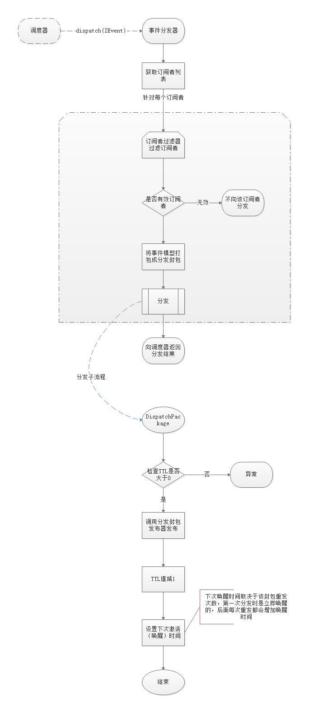

明源云会员事件系统
=========

## 背景：
目前，越来越多的第三方和会员系统接入，其中一个迫切的需求是当会员的一些信息发生变更时需要及时同步到相关第三方。
在没有事件机制的情况下，会员需要调用所有相关第三方的接口，扩展性很差。
    
另外，往往有这样的需求：某业务发生时，需要同步处理其他业务，但这些外围业务又明显不合适放在当前业务中
（如冗余字段变更以及其他跨业务领域的同步等），此时就可以使用事件机制异步处理。
    
事件系统采用 **发布-订阅** 模式，各业务根据需要发布相应的事件（如退出登录、修改信息等）到事件中心，事件中心将
事件分发给相关订阅者，订阅者（可以是明源内部其他项目或外部第三方）根据自身业务处理事件。

## 组件划分：


### 说明：
- `eventlib`: 公共库。如公用的外围服务（缓存、队列等），异常定义、基础设施、服务提供者基类、事件接口等。
公共库目前放在mSDK/event/下面。
- `eventconsumer`: 消费端库，也称作服务端库。包含消费端相关逻辑，如调度器、分发器、订阅者等。
消费端库目前放在MemberEvent项目下的console/lib/下。依赖eventlib。
- `eventclient`: 客户端库。领域事件基类、事件发布器等。目前放在mSDK/event/下面。依赖于eventlib。
- `eventpool`: 事件池。放具体的事件类。事件属于领域元素，理论上应当放在各项目中有项目自身维护，但由于目前会员项目并没有严格按照领域划分，
多个项目之间需要共用某些事件（如vmember和membercenter都是会员相关），因而无法放在各项目中。
目前会员的事件池放在mSDK/event/中，如membereventpool。

> 这些组件都是按照`composer`方式去开发管理的，模块本身不依赖于Yii框架、消息队列、数据库、缓存等。但由于目前我们是采用`framework/sdk`这种非`composer`方式管理公共库（组件），
因而上面的库（包）并没有完全 `composer`化，这种不完全体现在以下几点：
>> 1. 虽然是通过`composer install`安装各包的对外依赖，但提交git仓库时并没有完全忽略vendor目录，而是提交了那些运行时必须的依赖包。
 （完全composer化不能提交vendor中的任何内容到git仓库，而是要通过构建/发布平台用composer指令安装相关依赖。）
>> 2. 各包的`composer.json`文件的`autoload - psr-4`声明中不仅声明了本包的根命名空间，还声明了其依赖包的根命名空间，如在eventclient中声明了属于eventlib包的member_eventlib根命名空间。
这是因为实际中我们并不是用composer去安装事件系统各个包的依赖关系，而是通过sdk去组织的（在yii系统中需要用Yii::setAlias设定跟命名空间和目录的关系——显然这不是composer的工作方式）。
（composer原则是包的自我管理和独立完整性，而在包中声明其他包的根命名空间违反了composer原则（需要知道其他包的命名空间映射）。）

> 但是这些组件是很容易完全composer化的（只需要解决以上两点并补全composer.json其它必须信息即可）。

## 业务系统如何使用（针对Yii框架）：
1. 首次订阅，需在配置库的h_event_subscriber创建订阅者（需清缓存）；
2. 如有必要，需在配置库的h_event_source中增加事件来源（需清缓存）；
3. 在业务系统的bootstrap.php脚本中加入以下命名空间设置：
    ```
    \Yii::setAlias('@member_eventlib', '@mSDK/event/eventlib/src');

    \Yii::setAlias('@member_eventclient', '@mSDK/event/eventclient/src');

    \Yii::setAlias('@member_eventpool', '@mSDK/event/membereventpool/src');

    \Yii::setAlias('@Pimple', '@member_eventlib/../vendor/pimple/pimple/src/Pimple');
    ```
    其中member_eventpool是具体项目的事件池命名空间（也可以不给事件池设置单独的命名空间，使用项目的统一命名空间）。
4. 在项目中创建事件池目录，如membereventpool。
5. 在事件池中定义具体的事件，继承`member_eventclient\event\DomainEvent`
（最好是每个项目定义一个自己的事件基类，该项目下的所有事件继承此基类）。
6. 在需要发布事件的地方调用事件对象的send()方法发送事件。


## （业务系统）事件发布流程：


## 事件消费端调度流程：


### 分发器分发流程：


### 订阅者代理处理流程：


## 关键类与概念说明：

### 服务提供者`ServiceProvider`:
- 用来实现依赖注入，缓存、队列、发布器等都是通过服务提供者注入的。具体实现类在`config/ServiceMapping`中配置。各组件有自己的配置。
- 每个组件应当实现自己的ServiceProvider类并继承eventlib中的ServiceProvider类（参照eventclient中的ServiceProvider实现）。
- 组件中针对缓存、队列等外围基础设施接口都做了一个测试专用的实现（以Test开头的，如基于数组的TestCache），可用作单测和命令行测试。
- 可调用其`register`方法注册新的服务实现。

### 事件`IEvent`：
- `IEvent`是客户端与消费端共用的模型，继承`IPackage`，说明事件本身是一个封包（可以通过send传递信息）。

- 事件的继承关系：
    * `各事件池中的事件类 -> DomainEvent -> BaseEvent -> IEvent -> IPackage`
    * `ConsumerEvent -> BaseEvent -> IEvent -> IPackage`

- **领域事件** 在send之前可以修改各属性，send后不可修改。

- ConsumerEvent不可修改任何属性。

- **客户端** 与 **消费端** 的解耦实现：

    由于客户端和消费端是通过消息队列实现IEvent的传递，存在序列化和反序列化，在消费端反序列化时需依赖客户端的具体事件类，这样便无法解耦。

    解决方法是在事件发布器中隐式地将`DomainEvent`转换为消费端统一事件模型`ConsumerEvent`（继承其一切属性包括id），并结束掉DomainEvent的
    生命周期，由ConsumerEvent为其“续命”，序列化并入列。

    由于消费端依赖的是IEvent接口，因而这种转换对其是透明的。

- **订阅者（中间件）** 对事件的修改需求：

    一方面，IEvent发布后是不可修改的（因为其代表的是已经发生的历史事实），但另一方面，IEvent作为数据载体在到达最终订阅者那里前，根据具体
    订阅者的需求，可能需要定制其携带的信息。订阅者一般通过中间件定制事件所携带的信息。

    我们抽象出 **事件包裹器**  `SubscriberEventWrapper` 来解决这个矛盾。事件包裹器内部持有IEvent实例的引用，且对订阅者来说其行为和IEvent是
    一样的，而且可以通过data方法或下标获取/修改相关数据。（事件包裹器实现了`\ArrayAccess`接口）

- 领域事件的一些便捷操作：

    DomainEvent中使用`ObjectUtilTrait`实现了一些便利操作：
    * **将构造器的入参快速赋值给相应属性** 。具体领域事件实现类的构造函数可能要传入较多的入参，可在构造函数中用`$this->setProperties(__METHOD__, func_get_args())`
    一键赋值。前提是入参名和属性名要完全一样。
    * **注解** 。可以在属性注释中用`@data`注解告知此属性需要被收集（即调用data()获取数据时需要出现在数组的`body`字段中。数据收集时会将驼峰命名转为下划线命名）；
    用`@required`告知此属性是必填的。

- 事件 **分组** ：

    `IEvent::group()`的返回值。可将同类事件定义到同一个组，便于管理和订阅者按组订阅。例如，房产绑定和房产解绑属于同类事件，可定义到`member-room`分组下。

    每个具体的事件实现类必须实现`group()`方法告知自己所属分组。

- 事件 **名称** ：

    分组下的具体事件名，如member-room分组下的 **绑房产** 可命名为`bind`。

    每个具体的事件实现类必须实现`name()`方法告知自己的名称。

- 事件类 **命名** ：

    事件类的名称应当描述一个已经发生的操作事实，因而使用过去式命名。而事件的`name()`方法返回的是操作的一般形态（不具有时态性），应当用动词原形。

- **事件来源** ：

    简称 **事件源** 。两个独立的项目组可能都有“活动中心”，其中所发布的事件的分组和名称可能都相同，这样我们无法仅通过事件分组和名称区分。
    此时可以给两个项目组分别定义两个事件源编号（在配置库的h_event_source中配置，注意需要清缓存）。
    另一方面，同一个业务系统所发布的事件，根据触发方不同，事件源也应当不同。例如，在会员中心后台绑定房产和第三方调用会员api绑定房产，两者发布的“绑定房产”事件
    应当具有不同的事件源，这样订阅者可以屏蔽由它自己触发的事件。

    建议的做法是，各项目都有一个自己的事件基类，该基类定义该项目事件的默认事件源编号（如`const DEFAULT_SOURCE = '00000001-0000-0000-0000-000000000000'`），
    并设置`const SOURCE_PREFIX`常量强制从改项目发出的事件的事件源必须以该前缀开头（如`const SOURCE_PREFIX  = '00000001'`）。和该项目合作的第三方的事件源标识
    必须以此前缀开头。

    事件源必须在h_event_source中先定义好，格式是36位GUID格式（小写），其中第一部分是分组编号，如`00000001`是明源云会员组的编号，云会员组给第三方分配事件源编号
    时必须以此作为前缀。（根据实际情况，不一定非要为其分配，如果不分配则使用默认事件源编号）

    对于第三方合作者，一般我们会通过相关标识（如kong id）来获取其事件源id，可通过`EventSource::idOfFlag($flag)`获取真实的事件源id。

    注意：如果项目组不指定其默认事件源id，则会使用系统默认事件源`00000000-0000-0000-0000-000000000000`。

- 事件的 **唯一性** ：

    **来源 + 分组 + 名称** 界定一类事件；
    **事件id** 界定那一个事件；

- **垃圾事件** :

    当某个租户中发布的某类事件长期无任何订阅者订阅时，称其为垃圾事件。垃圾事件会无故占用消息队列和数据库资源。事件系统发现某租户某类事件
    是垃圾事件后，会直接丢弃掉。

    目前是基于缓存存储按月统计的。具体实现见`member_eventlib\event\maintain\GarbageCollection`。

- 一个事件类示例：
    ```
    <?php

    namespace member_eventpool;

    /**
     * 房产绑定事件
     *
     * Class RoomBoundEvent
     * @package member_eventpool
     */
    class RoomBoundEvent extends MemberBaseEvent
    {
        /**
         * @data
         * @required
         * @var string 房间id。必填
         */
        protected $roomId;

        /**
         * @data
         * @required
         * @var string 会员id。必填
         */
        protected $memberId;

        /**
         * @data
         * @required
         * @var string 会员mid。必填
         */
        protected $mid;

        /**
         * @data
         * @required
         * @var string 房产关系：一手业主、二手业主、同住人。必填
         */
        protected $relation;

        /**
         * @data
         * @var string 同住人与业主的关系：租客、亲属、好友等。选填
         */
        protected $relationWithOwner;

        /**
         * @data
         * @var string 关系开始时间（入住、租期开始等时间）。选填
         */
        protected $startDate;

        /**
         * @data
         * @var string 关系结束时间
         */
        protected $endDate;

        public function __construct(
            $tenant,
            $roomId,
            $memberId,
            $mid,
            $relation,
            $relationWithOwner = null,
            $startDate = null,
            $endDate = null,
            $source = self::DEFAULT_SOURCE
        ) {
            $this->setProperties(__METHOD__, func_get_args());

            parent::__construct($tenant, $source);
        }

        /**
         * 分组
         * @return string
         */
        public function group()
        {
            return 'member-room';
        }

        /**
         * 分类
         * @return string
         */
        public function name()
        {
            return 'bind';
        }
    }
    ```

- 数据收集：

    `data()`方法用来收集相关事件信息并转换为订阅者需要的格式（`json`或`xml`）发送给订阅者。

    用`@data`注解标识该属性是收集属性。收集时，会将驼峰命名转换为下划线命名，如`$memberId`会转为`member_id`。

    收集后的数组格式：
    ```
    [
      'type' => 'event',
      'id' => '8870c6bc-4d8a-4694-bf2a-3458991cde1f',
      'group' => 'member',
      'name' => 'logout',
      'tenant' => 'retesting',
      'timestamp' => 1505526819.5488491,
      'source' => '00000001-0000-0000-0000-000000000000',
      'body' => [
        'mid' => '1232345454334',
        'member_id' => '2332r3232',
        'openid' => 'qw2123eee',
        'logout_time' => 1505526819,
      ],
    ]
    ```

    数组转成`xml`后的格式：
    ```
    <?xml version="1.0" encoding="utf-8"?>
    <document>
        <type>event</type>
        <id>a51d6209-a2ed-4b9f-8f77-4b35b1894668</id>
        <group>member</group>
        <name>logout</name>
        <tenant>retesting</tenant>
        <timestamp>1505526945.3938</timestamp>
        <source>00000001-0000-0000-0000-000000000000</source>
        <body>
            <mid>1232345454 334</mid>
            <member_id>2332r3232</member_id>
            <openid>qw2123eee</openid>
            <logout_time>1505526945</logout_time>
        </body>
    </document>
    ```

    `json`格式：
    ```
    {
        "type": "event",
        "id": "370b00d8-b8cb-4cf5-9322-8d65152a78a6",
        "group": "member",
        "name": "logout",
        "tenant": "retesting",
        "timestamp": 1505528141.7378,
        "source": "00000001-0000-0000-0000-000000000000",
        "body": {
            "mid": "1232345454334",
            "member_id": "2332r3232",
            "openid": "qw2123eee",
            "logout_time": 1505528141
        }
    }
    ```

    注意，如果`body`中的某字段是一维数组，则会以`item`作为一位数组元素的key。如：
    ```
    [
        ...
        'body' => [
            'cars' => ['粤B12345', '皖A87679']
        ]
    ]
    ```
    转换成xml元素：
    ```
    <cars>
        <item>粤B12345</item>
        <item>皖A87679</item>
    </cars>
    ```


### 订阅者`Subscriber`：
- 分为 **本地订阅者** `LocalSubscriber` 和 **远程订阅者** `RemoteSubscriber` 两种。实践上，除非是直接通过中间件将数据推送给对方，否则建议使用远程订阅者。
本地订阅者实际上什么都不做，完全交由中间件处理。

- 订阅者的配置信息存储在配置库的`h_event_subscriber`中。

- 由订阅者工厂`SubscriberFactory`从配置数组创建订阅者对象。

    配置数组格式：
    ```
     [
           'id' => '123456',//订阅者id，必须
           'name' => '明源物业',//订阅者名称，必须
           'url' => 'https://www.baidu.com', //第三方接收事件消息的url,可选。如果配置了，则认为该订阅者是远程订阅者，否则是本地订阅者
           'data_type' => 'json', //第三方接收事件的类型,json或xml,可选，默认json
           'events' => [ //订阅的事件列表。必须
                   'tenant' => [
                       'eventgroup' => [
                               'event' => ['eventname1', 'eventname2'],
                               'in_source' => ['sourceid1', 'sourceid2'],//仅接收这些来源方的事件。可选
                               'ex_source' => ['sourceid1', 'sourceid2'],//不接收这些来源方的事件。可选
                           ]
                       ]
                   ],//其中的tenant和eventname可以用*，分别表示所有租户和分组下的所有事件
                     //其中in_source和ex_source可以采用前缀匹配，如'000001*'
           'secret' => '453454fff443f', //秘钥，用于数据签名。可选
           'cert_info' => [//https连接的ssl信息，可选
               'cert' => 'cert1.pem', //certificate证书路径，相对于eventlib/assets或绝对url(推荐)
               'cert_ca' => 'cert1.cer', //certificate的ca证书路径，相对于eventlib/assets或绝对url
               'cert_pwd' => '456dd' //certificate的password
           ],
           'client' => 'HttpsClient',  //指定使用哪个IHttpClient类发起请求（不同的第三方可能有不同的设置信息），可选。
                                       //类简名，相对于eventlib/src/infrastructure/httpclient/
                                       //默认根据url决定使用HttpClient或HttpsClient
           'client_extra_info' => ['myparam1' => 'value1'], //client的额外参数，作为IHttpClient构造函数的$extraParams传入，
                                                            //一般在要自己实现IHttpClient时作为额外参数使用。数组。可选
           'sign' => 'Signature', //指定使用哪个签名器签名，可选。默认使用Signature类。
                         //签名器必须在infrastructure/signature/目录或子目录下并实现ISignature接口
           'middlewares' => ['WgMiddleware'], //中间件列表，一维数组类简名，可选。
                                              //中间件必须是在subscriber/middleware/目录或其子目录下且实现IMiddleware接口
           'customize_data' => ['myvar1' => 'value1'], //其他自定义信息，数组，会原样传给Subscriber对象的customizeData属性
     ]
    ```

- **中间件** `IMiddleware` ：

     事件交由订阅者真正处理前会经过一系列中间件处理。

     输入：SubscriberEventWrapper和Subscriber。

     输出：SubscriberEventWrapper或SubscriberResponse。如果输出SubscriberResponse对象，订阅者中断后面的中间件以及其他流程执行，
     直接向外界返回接收到的SubscriberResponse对象。

     典型应用方式：
     当某个消费者需要自定义处理时，给该消费者定义一个中间件，在中间件中根据$event的类型执行不同的业务处理逻辑
     （而不是针对每种事件创建一个中间件）。

     当需要处理的事件类型较多或中间件业务很复杂时，可以给消费者创建一个入口中间件，该中间件根据事件类型等将任务分派给具体的业务处理类。

     另外，一些比较通用的中间件（可能会有多个订阅者用到）不要用订阅者命名，而是以处理的业务命名，而一些只针对某个订阅者的中间件则可以以订阅者命名。


### 调度器 `Schedular` ：
- 事件消费端的入口，调度、协调消费流程。

- 队列消费进程将接收到的对象信息反序列化后交给调度器，调度器根据接收到的封包具体类型决定后续流程：
    * `IEvent` ：持久化后交给事件分发器分发；
    * `DispatchPackage` ：交给订阅者代理处理；

- 接收并检查事件分发器和订阅者代理的处理响应（分别是`DispatchResponse`和`SubscriberResponse`）：
    * 如果从`DispatchResponse`中得知没有分发给任何订阅者，则调用`GarbageCollection`将该租户的该事件类型进行 **垃圾事件** 标记；
    * 如果发现`SubscriberResponse`的响应码不是`2**`，则执行封包重发，并调用`HealthInspector`对该订阅者执行 **不健康** 标记；

- 负责日志记录。


### 发布器 `EventPublisher` 和 `DispatchPublisher` ：
- 分别用来发布事件`IEvent`和分发封包`DispatchPackage`。
- 此处的发布器并不由外界直接使用，而是在`IPackage`封包的`send`方法中使用的。
- **为何在`send`中使用发布器** ：
    * 发布器封装并隔离了封包发布策略。
    * 虽然目前的发布策略很简单：直接入消息队列，但今后随着发送量的增加，可能会涉及到分布式、多消息队列负载均衡等，这些不同的策略可封装到不同的发布器中，
    通过服务提供者注入替换即可。


### 过滤器`IFilter`：
- 分为 **事件过滤器** 和 **订阅者过滤器** ，分别在事件库和消费者库的Config类的`eventFilters`和`subscriberFilters`中配置。
- 事件发布前、订阅者分发前都需要经过一个或多个过滤器过滤，只有通过检查，才会给予发送和分发。
- 目前事件过滤器有 **垃圾过滤器** ，检查事件是否为垃圾事件；订阅者过滤器有 **健康过滤器** ，用于检查订阅者的健康状态。


### 缓存：
目前以下地方用到缓存，当有数据更新时记得需要清缓存：

- 订阅者列表。当配置库的h_event_subscriber增加或修改记录时，需要清缓存。key: `member_event_subscribers`。
- 事件源。当配置库的h_event_source发生变更时，需要清缓存。key: `member_event_source`。
- 垃圾事件记录。如果发现某租户某事件因被判定为垃圾事件而不予发送，需要手动重置时，需要清除该缓存。key: 见`member_eventlib\event\maintain\GarbageCollection`。
- 订阅者健康记录。如果发现某订阅者因被判定为非健康态而不被分发事件，需要手动重置时，需要清除该缓存。key: 见`member_eventconsumer\subscriber\maintain\HealthInspector`。